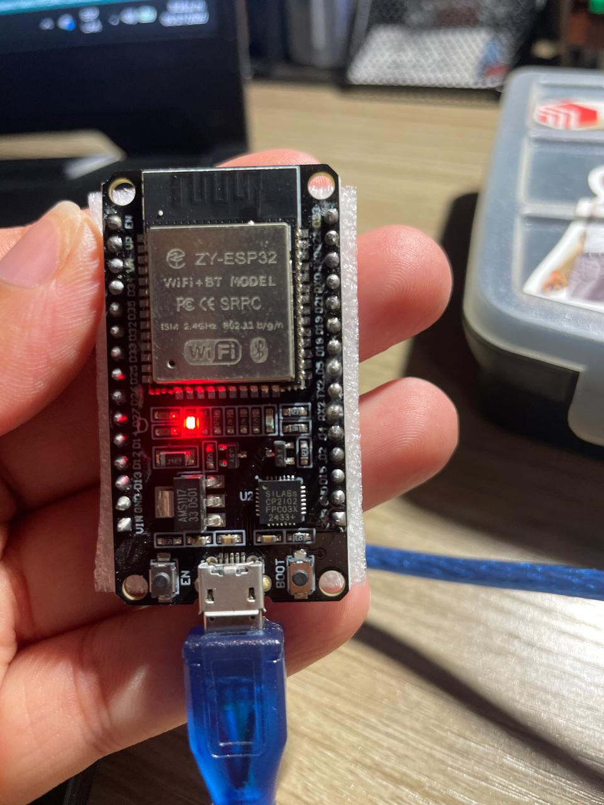
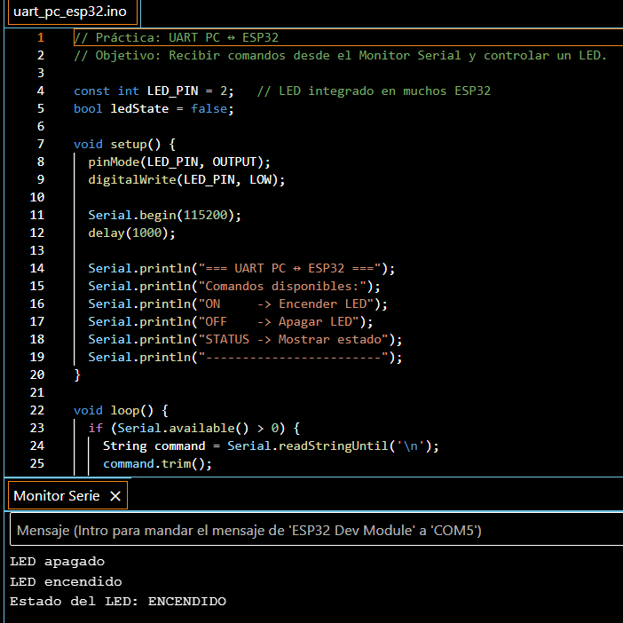

# Práctica UART — PC ↔ ESP32

## Objetivo

Comprobar la comunicación serial entre la computadora y el ESP32 mediante el Monitor Serial, enviando comandos de texto para controlar un LED.

---

## Materiales

- ESP32
- Cable USB
- PC
- Arduino IDE
- LED integrado del ESP32

---

## Hardware utilizado

| Componente | Modelo / detalle |
|---|---|
| Microcontrolador | ESP32 DevKit compatible |
| Módulo principal | ZY-ESP32 WiFi+BT |
| Chip USB-Serial | Silicon Labs CP2102 |
| Regulador de voltaje | AMS1117-3.3 |
| Puerto usado | COM5 |
| Pin del LED utilizado | GPIO 2 |
| Comunicación | USB-Serial / UART |
| Baud rate | 115200 |
| Software | Arduino IDE |

---

## Placa utilizada



La placa utilizada es una ESP32 DevKit compatible con módulo ZY-ESP32 WiFi+BT, chip USB-Serial CP2102 y regulador AMS1117-3.3.

La placa fue seleccionada en Arduino IDE como:

```txt
ESP32 Dev Module
```

---

## Protocolo utilizado

UART mediante conexión USB-Serial.

UART (Universal Asynchronous Receiver-Transmitter) permite enviar y recibir datos seriales entre dispositivos. En esta práctica se utilizó para enviar comandos desde la computadora hacia el ESP32 usando el Monitor Serial de Arduino IDE.

---

## Configuración utilizada

| Parámetro | Valor |
|---|---|
| Baud rate | 115200 |
| Final de línea | Newline |
| Puerto serial | COM5 |

---

## Comandos implementados

| Comando | Acción |
|---|---|
| `ON` | Enciende el LED |
| `OFF` | Apaga el LED |
| `STATUS` | Muestra el estado actual del LED |

---

## Código utilizado

Archivo:

```txt
uart_pc_esp32.ino
```

Funciones principales implementadas:

- `Serial.begin()`
- `Serial.available()`
- `Serial.readStringUntil()`
- `digitalWrite()`

---

## Resultado esperado

El ESP32 recibe comandos desde el Monitor Serial y responde con mensajes de confirmación.

---

## Resultado obtenido

La práctica funcionó correctamente. El ESP32 recibió comandos desde el Monitor Serial y respondió de acuerdo con la instrucción enviada.

### Comandos probados

| Comando | Resultado |
|---|---|
| `ON` | Encendió el LED |
| `OFF` | Apagó el LED |
| `STATUS` | Mostró el estado actual del LED |

### Respuesta observada

```txt
LED apagado
LED encendido
Estado del LED: ENCENDIDO
```

---

## Evidencia

### Monitor Serial



### ESP32 utilizado


---

## Errores encontrados

| Error | Posible causa | Solución |
|---|---|---|
| No aparece texto en el monitor serial | Baud rate incorrecto | Configurar baud rate en 115200 |
| El LED no enciende | Pin incorrecto | Verificar GPIO utilizado |
| No reconoce comandos | Final de línea incorrecto | Usar `Newline` |
| Puerto COM no aparece | Driver CP2102 no instalado | Instalar drivers Silicon Labs |

---

## Nota técnica

El ESP32 trabaja con lógica de 3.3 V. No se deben conectar señales de 5 V directamente a sus pines GPIO sin utilizar protección adecuada.

El chip CP2102 permite la comunicación USB-Serial entre la computadora y el ESP32. Esta comunicación fue utilizada para enviar comandos desde el Monitor Serial.

---

## Conclusión técnica

La comunicación UART permitió enviar y recibir datos entre la computadora y el ESP32 mediante USB-Serial.

Esta práctica demuestra cómo una placa puede recibir instrucciones externas, procesarlas y responder mediante mensajes seriales. Este principio es fundamental para tareas de depuración, control manual y comunicación futura entre sistemas robóticos como Raspberry Pi y microcontroladores.

---

## Estado

✅ Completado.
